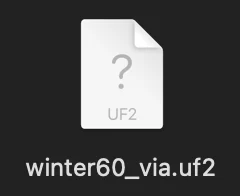
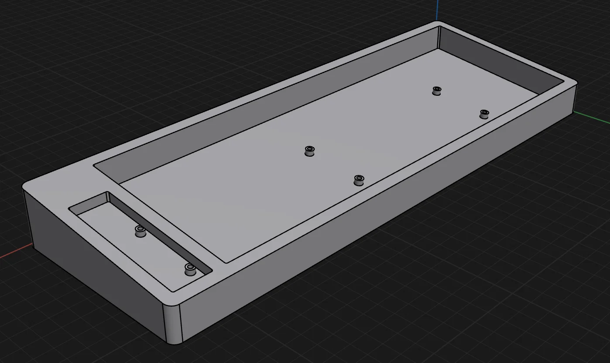
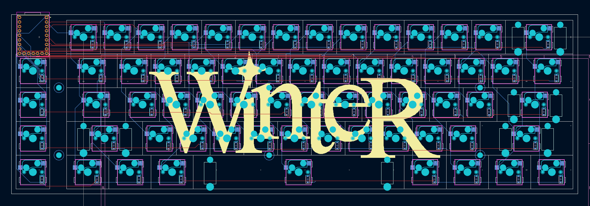
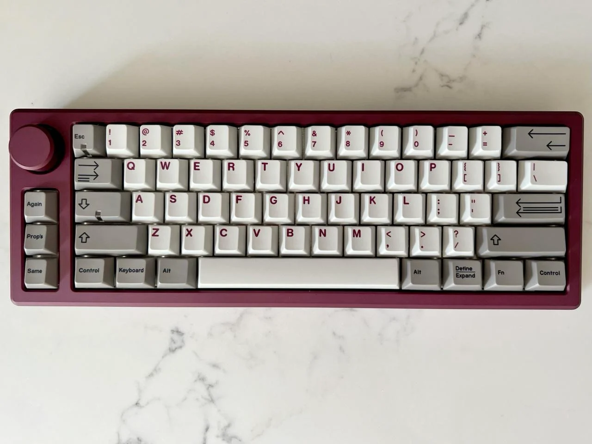
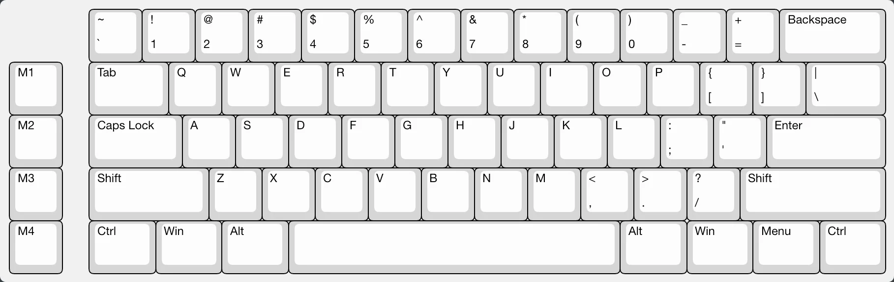
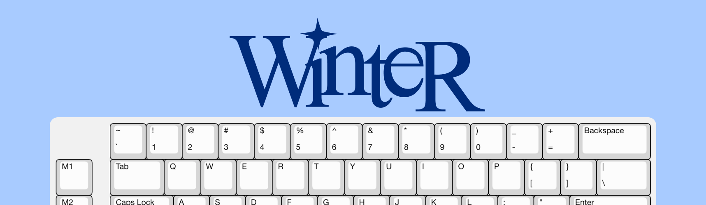

# Journal

## [11] New BOM
**June 6, 2026**
**1.0hr**

I redid the BOM today, and I tried to reduce the price as much as I can.
I'll do the case today aswell but later.

I added links for the rotary encoder, screen, and standoffs, and found a cheaper keycap set.

## [10] Finishing the new PCB & remodeling
**June 5, 2026**
**10.0h**

I had to redo a LOT of the old case, and I also had to fit the new screen.
I spent so much time figuring out how I was gonna mount out the case and I lowkey had no idea whatsoever. I got close to the giving up point again because I was so frustrated with everything.

I decided to use two 2.5x8mm spacers to space the screen. I ended up making the PCB symmetrical on both sides, which did extend it. This just means the case will have to be printed in two parts, which is fine.

I redid the entire firmware + added a tamagotchi thing that will stay on the screen and have different moods.

Here's a pic of the new case. I also added two more mounting holes just to make sure the pcb wouldn't like fall or tilt.

I need to redo the entire BOM now and fitting this into 120$ is gonna be tight.
Anyway's we'll see.

BAI

## [9] Adding a knob and a screen
**June 3, 2026**
**6.0h**

I added a knob and a screen to the pcb.

I wanted to make it more complex, so I decided to overhaul everything, I started by replacing the old mcu (rp-2040-zero) with the new one, which is the RP Pico.

It is quite big and ugly, which I hate personally, but I needed the extra GPIO pins for the OLED screen and the rotary knob.

I had to redo the entire schematics and the PCB and it was extremely tedious and long. I didn't manage to make the pcb fully error free, there's some issues which I'll fix next time!

I'll have to work on updating the case next, so it can accomodate the bigger PCB.

## [8] Finishing the Repo & Making BOM
**May 26, 2026**  
**2.0h**

After a two-week hiatus from this project, i finally decided to complete it.
I found all the thingies that I wanted to order and made a bom.csv file

I also made the gerbers and exported the .step files
I accidently deleted this one thing in the schematics lmaoooo aahhhh

### Transferring to Open Sauce

I decided to transfer the project to Macondo to OpenSauce.
So i just copied the journal and formatted it into this file!

---

## [7] The Github Repo  
**May 13, 2026**  
**0.4h**

### The Repo

I was super busy all day today so I couldn't do much, so I decided to keep my streak by making a quick GitHub repo, and committing the new fixed firmware to it.

I had already began making the repo before, and I had added a basic README and committed the old version of the firmware.

Here's the repo:  
https://github.com/aryan-madan/Winter60/

### The BOM

I did work on the BOM a bit, I picked out the keycaps and calculated some stuff. BOM should be done by tomorrow? I think.

Okay BAIIIIII!

---

## [6] Firmware (Part 2) & Schematics  
**May 12, 2026**  
**2h**

### The issue

I finally figured out what I was missing, and it was the `keyboard.json` file, which I had called `info.json`, so QMK didn't even recognize my keyboard as a valid keyboard.

So, I renamed the file and removed whatever duplicates that were there and I ran the compile command again ANDDDD WOOHOOOOOO, it worked! I now have the compiled `.uf2` file.

BEHOLD THE FILE IN ALL ITS GLORY!

### Schematics

After successfully compiling the `.uf2` file, I moved on to beautifying everything and finally making the repo for the keyboard.

I added these bounding boxes thingies to better sort the schematics.

I'm still not a fan of the silkscreen on the keyboard, it's too simple rn so I'll work on that tomorrow. Gotta keep the streak goinggg.

### Next Steps

I'm thinking of finally making the BOM, i had been procrastinating so much over it. I'll pick out the parts and stuff tomorrow.

Oh and I forgot to sanity check the case but I think it's okay? Dear reviewer please check the case <33

Okay BAIIIIII :D

---

## [5] Firmware  
**May 11, 2026**  
**3.6h**

### The Firmware

The PCB itself is pretty much finished so I thought I'd go ahead and do the firmware. I chose QMK as the firmware since I planned on adding VIA support to the keyboard as well.

The actual firmware stuff was pretty alright, kinda repetitive ig, most of the time went into tryna figure out how to structure the board, fixing bugs. Last time I had made an error with the firmware where I did `row2col` instead of `col2row`, i think i didnt do the same mistake again? we'll know once i make the keyboard.

### VIA

This was my first time setting up VIA/Vial so a lot of time went into figuring out how that would be done. I logged like half an hour from Hackatime which I haven't included here.

I found QMK Configurator which I thought would help but i lowkey didn't know how it worked. So i just went into my QMK repository that I cloned locally, found a 60% board and tried to edit it into my layout.

Firmware is lwk not about writing a lotta code, it's pretty repetitive. I took a lot more time reading docs and debugging.

HOWEVER, after doing everything, when i came to compiling the keyboard its not working, idek the issue, QMK doesn't recognize the directory as a valid firmware thing. I checked if i had missed anything, i don't think so?

I'll continue this tomorrow i'm too tired. Great posture too btw!!! (sarcasm)

### Next Steps

I'm gona sanity check the case once, and then make a BOM. I think $150 is gonna be enough tbh, we'll see.

---

## [4] The Case  
**May 10, 2026**  
**4h**

### Start

I had no idea what to do with the case tbh, I wanted something that looks nice and worked. Last time I had gone too overboard with the details, I had engravings and stuff and the case just didn't end up looking good.

Keeping in mind the restrictions of 3D printing, I wanted something that looked nice, could print well and was functional.

### Design

I wanted a tilt, so I went with a 7 degree tilt. It just makes typing much more comfortable.

.png)

I was considering leaving the space above the MCU empty, so you could see it, but I decided against it. I added this blocker instead which would be pretty nice for putting stickers or smth on.

.png)

As for the mount, I had previously done a friction fit mount, which did NOT work. I went with a simple screw mount, where you just screw the PCB to the case.

.png)

The screws are M2.5 X 4mm, which should be fine. I also checked the PCB to make sure that none of the traces were colliding with the screws.

Here's a full pic of the case:

Last time, I had made the USB-C hole way too small, so I added the 3D model for the MCU, and appropriately sized the USB-C cutout. I HOPE it's alright now 🤞

.png)

I put everything in, to see if it fits nicely, and it does, the PCB has like 1mm of margin at the sides to fit.

.png)

However because my PCB has like a bit of a margin on its own, it looks asymmetrical here and this pmo sm.

Fml i dont wanna redo the PCB again ughh. I also have to make a plate!!!

### Next Steps

Next steps are gona be to make the plate, and then the firmware. I'm prolly gonna use QMK, and make it VIA compatible aswell. Then the BOM woohoooooo :D

Ok bye

---

## [3] Disaster Struck  
**May 9, 2026**  
**1h**

### Disaster

I was experimenting with the knob for the PCB, so i copied a backup of the PCB files and pasted the same folder. I accidentally overwrote the existing file, which removed all my progress to the last backup I took 😭😭

### Disaster Control

I'd completely lost motivation at this point and i wanted to recover the file again, the silkscreen, routing and the screw holes were completely gone.

Thankfully the diode and socket placements were still there, if not i guess we'll never know.

So i re-ran the free routing plugin and fixed some of the routes. I put off doing the knob rn cause I just wanted to have a base, knobs might be growing on me.

I did put everything back together at the end tho which is nice.

### Next Steps

Next i'm gonna do the case, I really wanna get this part right because last time, I completely messed up the case and it just didn't work :(

---

## [2] PCB Designing  
**May 8, 2026**  
**3.1h**

### The easy part

I had previously used a plugin called KBPlacer to automatically layout the diodes and the hotswap sockets into my layout.

I extracted the `.json` file from KLE and I put it into the plugin. It automatically arranged the components into my layout.

### The hard part

I tried routing the PCB manually because beauty or whatever, ugh, which was not working, so I gave up and installed the FreeRouting plugin and tried using it but it would just give me spaghetti routes.

So I tried fixing them but I lowkenuinely didn't get anywhere but more DRC errors. After a while of failure, I just decided to use the output that auto-routing gave me. (wow, good job ary)

Beep boop beep and voila! The DRC showed 0 errors.

I also added holes for mounting using screws and I added holes for stabilizers. I'm gonna be using PCB-mount stabs, which are just superior, my last experience with plate-mount stabs was really bad.

I'm gonna add more silkscreen cuz rn its like bland it has like 45 personality. I'll work on the case next or the firmware, depends on my mood tbh.

I don't know why I started this in the middle of my unit tests like bro studyyyy. Anyways I went with a more chalant approach for this journal, i hope u like it.

Like and subscribe for more 👍

Byeeeee :P

---

## [1] Schematics & Back story  
**May 7, 2026**  
**3h**

### Backstory

I am a keyboard addict. I've been in love with the mechanical keyboard community for almost 6 years now.

I made my first keyboard in Blueprint, which was also my first ever hardware project. I made a 65% hotswap keyboard for it, which had design flaws and ended up not fully working.

I wanted to redeem myself by giving myself another shot and making another keyboard.

### Schematics

So, I decided on making a 60% keyboard with 4 dedicated macro keys.

### Why this layout?

I wanted to make this keyboard to be a mix of a macropad, and a normal keyboard. While looking for inspiration, I found a keyboard called the Day Off 60. I really liked its layout, so I thought of making something similar.

So, I recreated the layout on KLE. I was deliberating whether I should add a knob, or keep the keys, and I decided against the knob for now.

I'm not a fan of knobs on keyboards and I think they are more suitable for macropads :P

### The MCU

I left a 1u blank space on the top left of the keyboard to include the MCU. For the MCU, I decided on using the RP2040Zero from Waveshare.

I really liked that it had USB-C and that it had sufficient pins, overall I found it to be a really nice beginner MCU.

I wanted the MCU to feel integrated into the board, without extending the board or awkwardly poking out. I feel like adding a knob instead of the keys would look uglier and break the symmetry. Although, I'm heavily considering making a copy of the project and seeing how a knob would look like.

### Switch Matrix & MCU Schematics

I then made the switch matrix, and used Cherry MX switch footprints in KiCad.

I also assigned the pins on the RP2040Zero.

My switch matrix last time was very messy, so I tried to make one as clean as possible this time.

I'm pretty happy with the progress at this point, this new keyboard is turning out cleaner than the last one for sure. The next obvious step is to design the PCB.

### The Name

I thought about what I wanted to call the keyboard and Winter seemed like a cool name. I want this keyboard to have a personality. I decided to whip up a quick design for the name.

I'm also thinking of adding a snowflake or something similar on the top left of the board, in the empty space.

Okay I think that I might have made this way too long but I wanted to share everything I had! Byeee! :D