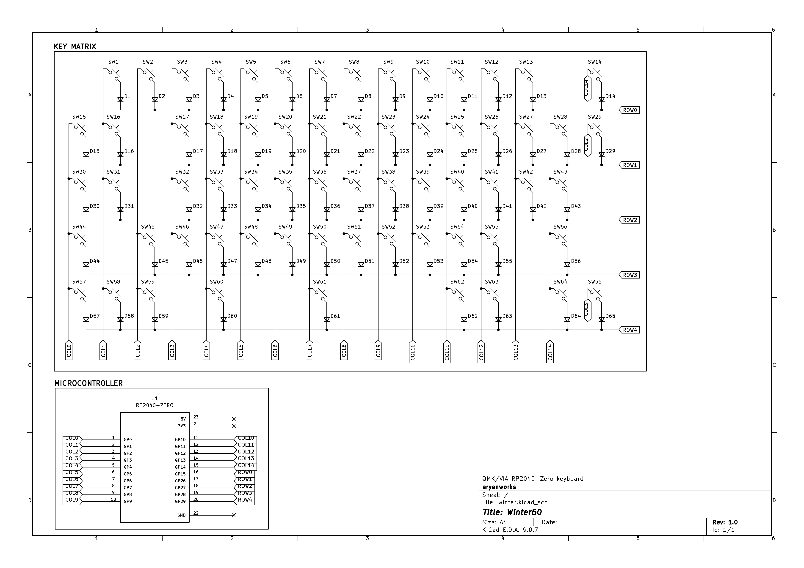

# Winter60

#### This project was transferred from Macondo to Open Sauce.

Here's the Macondo project link: https://macondo.hackclub.com/projects/2084

# Backstory

I am a keyboard addict. I've been in love with the mechanical keyboard community for almost 6 years now.

I made my first keyboard in Blueprint, which also my first ever hardware project. I made a 65% hotswap keyboard for it, which had design flaws and ended up not fully working. I wanted to redeem myself by giving myself another shot and making another keyboard. So, I decided on making a 60% keyboard with 4 dedicated macro keys.

# Layout

The Winter has a 60% layout with 4 macro keys in the left.
The macro keys provide dedicated support for macros, which can be bound to in-game callouts, hotkeys, etc.

# Firmware

The firmware for the Winter is located in the '/firmware' directory.
The Winter60 uses QMK for the firmware.

# Schematics & PCB

## Schematics

## PCB

# CAD

# BOM

The total bill of materials totaled to about $145.
You can see the complete [BOM.csv](BOM.csv)

Made with ❤️ by Ary